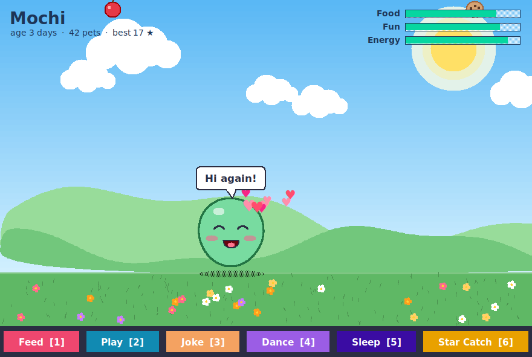
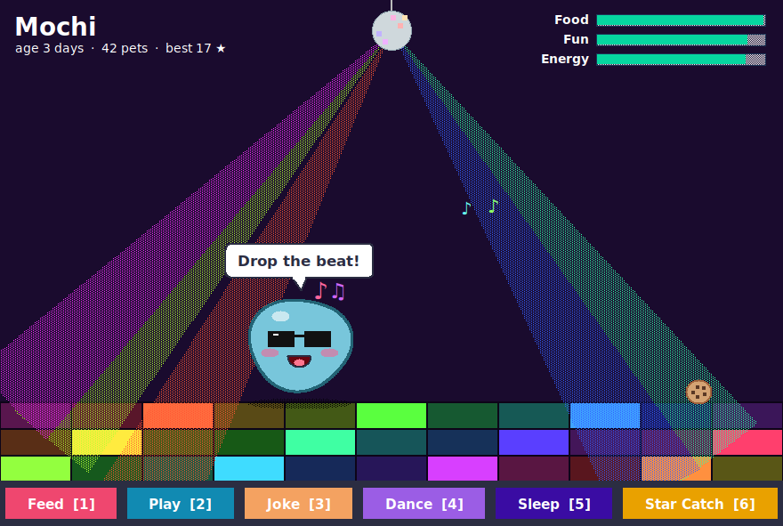
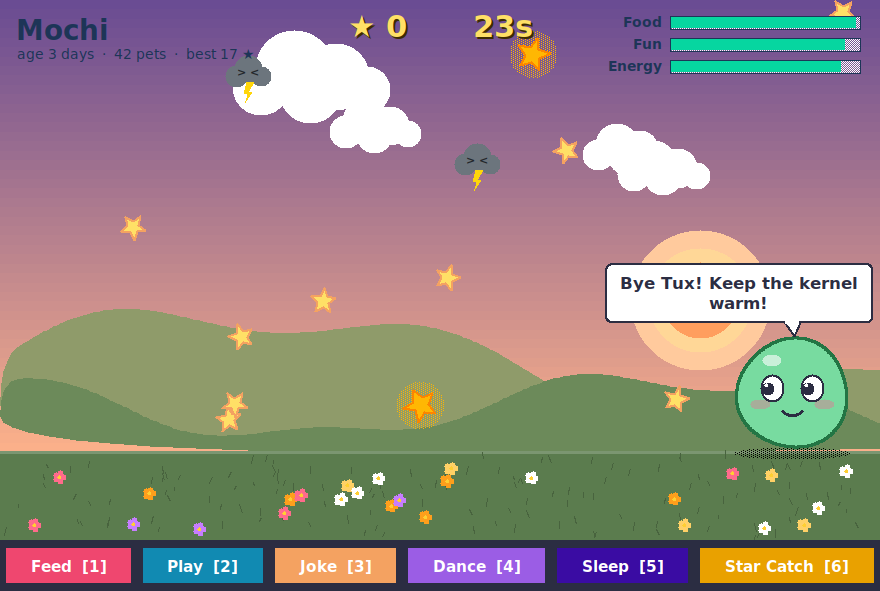
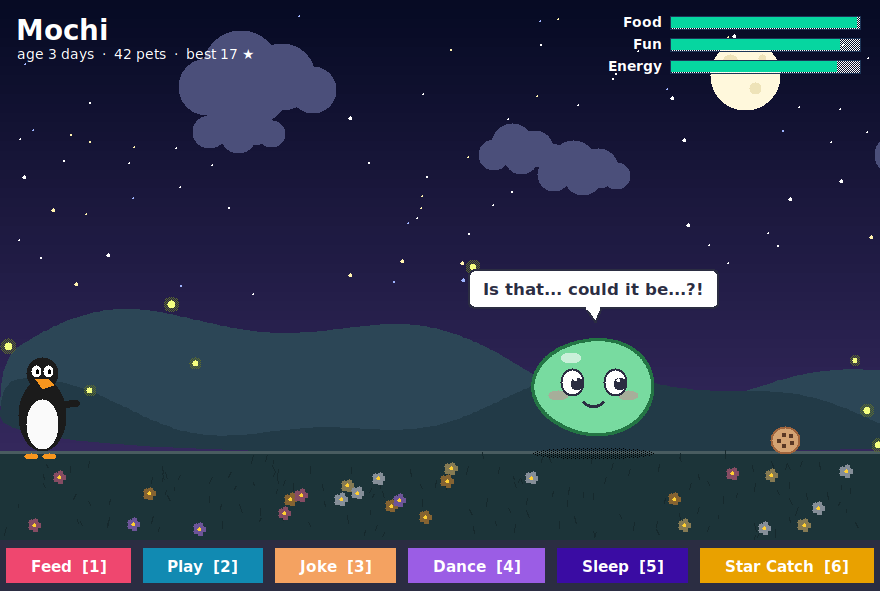

# Mochi, your pocket blob

Mochi is a small, squishy virtual pet that lives in a window on your desktop. You can pet it, feed it, throw it, play ball with it, have a dance party, hear bad jokes, and play a star-catching mini-game. The sky follows your real clock, and Mochi remembers you between runs.



## Run it (Linux Mint)

```bash
cd mochi
python3 mochi.py
```

It uses plain Python 3 and Tkinter, with no pip installs. If you get `No module named tkinter`, install it with:

```bash
sudo apt install python3-tk
```

### Add it to your app menu

```bash
./install.sh      # adds "Mochi" under Menu → Games, with an icon
./uninstall.sh    # removes it (add --forget to also erase Mochi's memories)
```

## How to play

| Do this | What happens |
|---|---|
| **Click Mochi** | Petting. You get hearts and giggles. |
| **Drag and let go** | Throws Mochi. If you throw it hard enough, it gets dizzy. |
| **Click the ground** | Mochi hops over to that spot. |
| **Click the ball** | Kicks the ball. |
| **Right-click** | Opens a menu to rename Mochi, change its colour, pick the sky, or read the help. |
| `1` Feed | Snacks fall from the sky and Mochi hops over to eat them. |
| `2` Play | Drops in a beach ball. |
| `3` Joke | Mochi tells a (terrible) joke. |
| `4` Dance | Disco ball, dance floor and sunglasses. |
| `5` Sleep | Recharges energy. Mochi also falls asleep on its own when it gets too tired. |
| `6` Star Catch | A 30-second mini-game. Move with the mouse or arrow keys, jump with `Space`. Gold stars are worth +5, and storm clouds cost you points and make Mochi dizzy. |

Keep **Food**, **Fun** and **Energy** up to keep Mochi happy. When one runs low, Mochi will let you know.

There are also a few **secret words** you can type while the window is focused. Try `tux` first 🐧

| | |
|---|---|
|  |  |
|  | |

Mochi's save file lives in `~/.local/share/mochi/save.json`.
